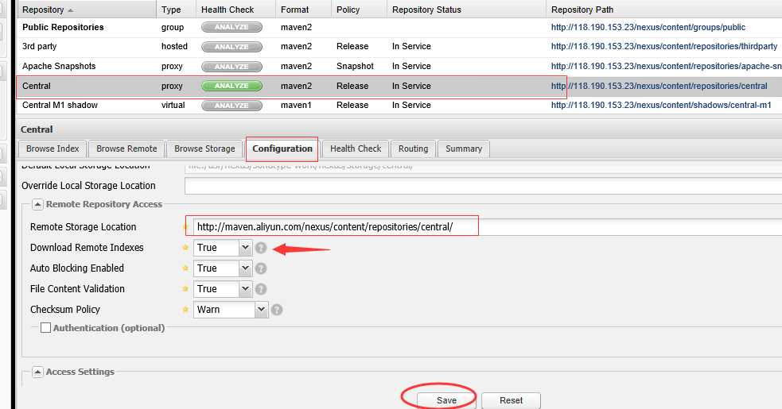

nexus 搭建 maven 私服
==

### Installation 

官网地址:  https://www.sonatype.com/download-oss-sonatype

```
curl -L https://sonatype-download.global.ssl.fastly.net/nexus/oss/nexus-2.14.5-02-bundle.zip \
     -o  /usr/nexus-2.14.5-02-bundle.zip
unzip -q /usr/nexus-2.14.5-02-bundle.zip -d /usr/nexus

useradd nexus
chown -R nexus:nexus /usr/nexus
```

create the file in /etc/init.d/

```
vim /etc/init.d/nexus
```

copy the following content

```
#!/bin/sh 
# chkconfig: 2345 99 01 
# processname: nexus 
# description: start nexus on boot 
 
su - nexus -c "/usr/nexus/nexus-2.14.5-02/bin/nexus start"

```

make the service on server reboot

```
chmod 711 nexus
chkconfig nexus on
```
 
【Optional configuration】 , ``` vim /usr/nexus/nexus-2.14.5-02/conf/nexus.properties ``` 
you may want to change the port other than 8081

```
# Jetty section
application-port=8081
```

### Run

You can run nexus in two ways.

- start as a service

```
systemctl start nexus
```

- start as a application

```
su - nexus
/usr/nexus/nexus-2.14.5-02/bin/nexus start
```


Let's take a look at what commands nexus can support.

```
[root@izm5eaj3xjio5ppzd4ubxtz bin]# ./nexus
Usage: ./nexus { console | start | stop | restart | status | dump }
```

http://localhost:8081

the default user name/password is ``` admin/admin123    ```

don't forget to change them here.  [qijunbo123#]


 

 
And you can choose to sync the jars from manven central to local server like this.

I chose aliyun as the default server,  it's pretty fast in China.  But you can keep the default value and not change it.




### Forget Password

Open  ``` /usr/nexus/nexus-2.14.5-02/conf/security.xml ``` and find this section,  and change the password value to ``` f865b53623b121fd34ee5426c792e5c33af8c227 ``` , then the password is reset to ``` admin123 ``` 
```
 <user>
      <id>admin</id>
      <firstName>Administrator</firstName>
      <lastName>User</lastName>
      <password>$shiro1$SHA-512$1024$3+ELe1C+iampCnu74tz4dw==$Yk7uIZsHCTXwFkjCA0zdgKu/pZAaENiCu59OCJfdRwBEfxh/szejMlr45tvX+zhZdFZvLoqphLT7I1t7pj1yDw==</password>
      <status>active</status>
      <email>changeme@yourcompany.com</email>
 </user>
```

Restart the nexus server.

```
su - nexus
/usr/nexus/nexus-2.14.5-02/bin/nexus restart
```

you can even change the  admin user id to some other value,  so that other people can not guess the admin login id.

Reference:
--

中文版安装指南：

http://www.cnblogs.com/h--d/p/5717920.html

中文版使用指南：

http://blog.csdn.net/HUXU981598436/article/details/54945589


http://blog.csdn.net/xiaoreqing/article/details/51352751


http://blog.csdn.net/shenshen123jun/article/details/9084293

忘记密码:

https://support.sonatype.com/hc/en-us/articles/213465508-How-can-I-reset-a-forgotten-admin-password-